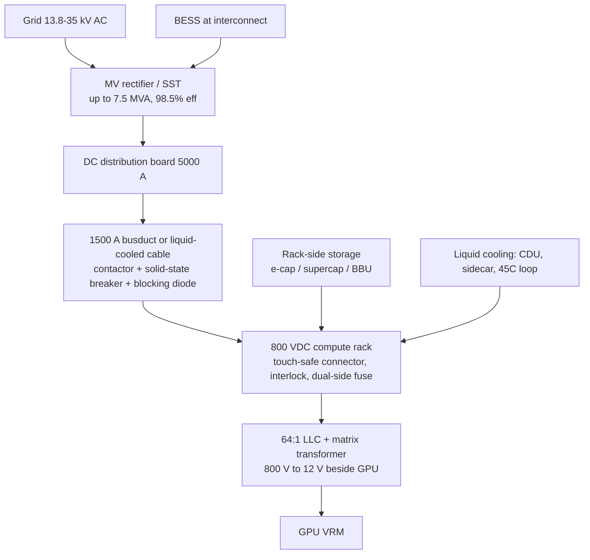

# 英文 memo 內容路線圖

> 這是內部規劃文件，不會被 `lib/content/en-memos.ts` 讀取，不會變成網頁。
> loader 只掃 `content/en/memos/` 與 `content/en/topics/`。

---

## 方法論修正（重要）

第一版做錯了順序：直接去 MongoDB 搜「800V / HVDC」關鍵字，讓資料庫決定供應鏈長什麼樣。

**正確順序**：先讀 NVIDIA 官方架構定義 → 拆出每個環節需要什麼零件 → 找台廠卡在哪一格 → 最後才查 DB 有沒有可用的法說會。

沒有法說會資料的環節，不代表不重要，只代表我們暫時寫不出 memo。這個差別要寫進 to-do，不能靜靜跳過。

**官方來源**
- 白皮書：[800 VDC Architecture for Next-Generation AI Infrastructure](https://developer.nvidia.com/blog/building-the-800-vdc-ecosystem-for-efficient-scalable-ai-factories/)（Jared Huntington & Mike Tu）
- 產品頁：<https://www.nvidia.com/en-us/data-center/technologies/800-vdc-architecture/>
- OCP：與 Google、Microsoft 共同發表 LVDC / SST 規格，Mount Diablo 側掛式 power rack

---

## 一、NVIDIA 800 VDC 架構分層

規格重點：2027 年 Kyber 機櫃（單櫃 576 顆 Rubin Ultra GPU）進入 1 MW 級；同截面積銅線輸電量比 415 VAC 多 **157%**，省掉約 200 kg 銅排。

導入三階段（官方時程）：

| 階段 | 內容 | 時間 |
|---|---|---|
| 1. Side power rack / Sidecar | 舊機房retrofit，AC 整流移出運算櫃 | MGX 相容 power rack 2026 下半年 |
| 2. Row power center | 整排共用，架空 800 VDC busway，最高 2 MW/row | 2027 |
| 3. DC power block | 新建廠房，市電一次轉 800 VDC | Kyber 量產同步 |

參考設計（白皮書 Figure 11）：17.5 MW 區塊 = 5 台 3.5 MW MV rectifier（5 做 4 備援）→ 5000 A 配電盤 → 四座 1.1 MW 運算櫃 + CDU。

---

## 二、每個環節需要什麼、台廠卡在哪

官方點名的台廠只有 4 家：**台達電（電源元件）、光寶科（電源元件）、貿聯-KY（電源元件）、立錡（矽晶片）**。其餘為外資報告或公司自述。

| 架構環節 | 需要的東西 | 台廠 | 我們的 memo |
|---|---|---|---|
| 市電/併網、BESS | 併網調頻、儲能 | 熙特爾-創(7740)、錸德(2349) | 熙特爾 1 篇 |
| MV rectifier / SST | 中壓整流、固態變壓器 | 東元(1504)、士電(1503)、中興電(1513)、華城(1519)、亞力(1514)、朋程(8255) | 東元、亞力、中興電各 1 篇（設施側，非正式 MV rectifier）；朋程 1 篇（SST 路線圖） |
| DC 配電盤 / busway | 5000A 盤、1500A 匯流排、固態斷路器、隔離接觸器 | 亞力、士電、佳必琪(6197)、良維(6290) | 佳必琪 1 篇（僅 ±400V busbar）；東元 1 篇（busway 訂單，非 800V） |
| Side power rack / PSU | 90kW power shelf、整流模組 | **台達電(2308)**、**光寶科(2301)**、康舒(6282)、旭隼(6409)、全漢(3015)、金寶(2312) | 光寶 5、台達 4、旭隼 1、康舒 1、金寶 1 |
| 機櫃機構件 | 機櫃、匯流排機構、液冷機殼 | 晟銘電(3013)、**貿聯-KY(3665)**、凡甲(3526) | 晟銘電 1 篇 |
| 連接器 / 線材 | touch-safe 連接器、機械互鎖、液冷電纜 | **貿聯-KY(3665)**、瀚荃(8103)、凡甲(3526)、良維(6290)、信邦(3023) | 貿聯 1 篇（2023）、瀚荃 1 篇 |
| 保護元件 | 高低側雙保險絲、PPTC、繼電器、接觸器 | 富致(6642)、松川精密(7788)、虹揚-KY(6573) | 富致 1、松川 1 |
| 熱插拔 / 電源管理 IC | hot-swap controller、800V 架構 IC | 安馳(3528，代理 ADI)、**立錡（未單獨上市）** | 安馳 1 篇 |
| 功率半導體 SiC/GaN | SST 用 SiC、GPU 端 GaN | 漢磊(3707)、嘉晶(3016)、朋程(8255)、捷敏-KY(6525) | 漢磊、嘉晶、朋程、捷敏各 1 篇 |
| 磁性元件 / 材料 | matrix transformer 磁芯、SiC 粉體 | 越峰(8121)、環科(2413)、千如(3236) | 越峰 1、環科 1 |
| 封裝載體 | 高壓導線架、雙面散熱、Clipper | 長科*(6548)、界霖(5285) | 長科 3、界霖 1 |
| 儲能（機櫃側） | 電解電容 <100ms、超級電容、BBU >10s | 系統電(5309)、金山電(8042)、愛普*(6531)、熙特爾-創(7740) | 系統電 1、熙特爾 1 |
| 液冷 | CDU、sidecar、冷板、45°C 迴路、液冷匯流排 | 奇鋐(3017)、雙鴻(3324)、健策(3653)、泰碩(3338)、建準(2421) | 建準 1 篇（800V EC 風扇） |
| 測試驗證 | HVDC 測試設備、電源分析儀 | 固緯(2423)、美達科技(6735) | 固緯 1 篇 |
| 機櫃組裝 ODM | Kyber / NVL144 整櫃 | 鴻海(2317)、廣達(2382)、緯穎(6669) | 鴻海 6 篇（至 2026Q2） |

---

## 三、TO-DO

### P0 — 補官方名單缺口（已翻完現有資料）

- [x] **台達電 2308** — 4 篇（2023Q3、2023Q4、2024Q3、2024Q4）。DB 最新停在 2025-03-11。
- [x] **貿聯-KY 3665** — 1 篇（2023Q3）。DB 最新只有 2023-12-19，memo 內已標註資料過期。
- [x] **鴻海 2317** — 6 篇（2023Q3、2024Q3、2025Q1、2025Q4、2026Q1、2026Q2）。2026 三場已補轉錄並寫成英文。
- [x] 立錡 — 聯發科子公司、無獨立法說會，已在 hub 說明，不開公司頁。

**P0 剩餘（需要資料，不是需要翻譯）**

- [x] 重跑鴻海 2026-03-16、2026-05-14、2026-08-12 的轉錄（已 completed，英文 3 篇已上）
- [ ] 查台達電 2025-03 之後的法說會為何沒進 DB
- [ ] 查貿聯 2024 年起的法說會為何沒進 DB
- [ ] 選作：台達電 2014–2023H1 還有 37 場、鴻海 2020–2022 還有 6 場可補檔（與 800V 無關，純長尾）

### P1 — 有完整中文 memo、可直接翻（照架構順序補）

- [x] 康舒 6282（PSU / power rack，2026-03-12）— 該場沒提 800V，AI 是 CRPS / 資料中心電源 / 燃料電池
- [x] 界霖 5285（功率導線架、雙面散熱、Clipper，2026-05-21）
- [x] 越峰 8121（SiC 粉體 + 磁芯，已供 HVDC 800V，2026-05-20）
- [x] 朋程 8255（SiC 模組 650–3300V，自述 2027-2030 HVDC、2031-2035 SST 三階段，2026-05-26）
- [x] 漢磊 3707（SiC/GaN 功率代工，2025-09-17）
- [x] 嘉晶 3016（GaN 磊晶已進 800V 系統，2026-04-29）
- [x] 系統電 5309（BBU 11kW/5.5kW，HVDC 2027-28 量產，2026-03-10）
- [x] 熙特爾-創 7740（1500V 平台下打 800V HVDC BBU，2026-05-28）
- [x] 松川精密 7788（高壓直流繼電器、Super Seal 液冷型，2026-03-04）
- [x] 瀚荃 8103（連接器；該場沒說 800V，有 sidecar / Power Shelf / 48V DC-DC，2026-05-20）
- [x] 環科 2413（交換機電源朝 8000W+，下一代走 HBDC 800V，2025-12-17）
- [x] 固緯 2423（HVDC 測試設備開發中，2026-07-29）
- [x] 金寶 2312（充電樁技術轉 HVDC + 高階伺服器機櫃，2026-06-30）
- [x] 捷敏-KY 6525（功率封測，2026-03-10）
- [x] 東元 1504、亞力 1514、中興電 1513（中壓/設施側代表；該三場都沒提 800 VDC）
- [ ] 華城 1519 / 士電 1503（中壓側未翻；可選）

### P2 — 液冷（800V 的雙生問題，官方 NVL144 用 45°C 液冷 + 液冷匯流排）

- [ ] 奇鋐 3017 — 2026-08-12、2026-05-14、2025-05-20 已 completed，英文尚未寫
- [ ] 泰碩 3338、樺漢 6414 — `transcriptionStatus: failed`，要重跑
- [ ] 雙鴻 3324 — `pending`，要重跑；上一場 completed 是 2025-05-23
- [ ] 健策 3653（2025-11-28，可直接翻）

### P3 — 內容品質

- [x] 主題 hub 加「官方 vs 自述」分層標示。
- [x] hub 補上官方架構圖與三階段時程。
- [x] 佳必琪那篇實際是 OCP ±400V，不是 NVIDIA 800V 單極；hub 已註明。
- [x] 每篇有「NVIDIA 800V read-through」說明這家在架構的哪一格。
- [ ] 選作：佳必琪可再加 `ocp-400v` tag 區隔。

### P4 — 資料管線

- [ ] 盤點 `earnings_call` 的 `failed` / `pending` 文件數量，排重跑優先序（奇鋐已 completed；雙鴻、泰碩、富世達後兩場最急）。
- [ ] 台達電、貿聯的法說會為何沒進 DB — 是沒抓到還是沒開？要查。

---

## 四、下一批主題（800V 之後）

同一套流程可以複製：先找官方/標準組織定義，再對台廠。DB 內 2025 年後完成轉錄的中文 memo 約 2,556 篇，覆蓋面足夠。

| 主題 | 錨點來源 | DB 可用篇數（2025 後） | 台廠家數 |
|---|---|---|---|
| AI server rack ODM（GB300 / NVL144 / Kyber） | NVIDIA MGX、OCP | 466 | 286 |
| SiC / GaN 功率元件 | NVIDIA 800V 名單、車用 800V | 223 | 140 |
| CoWoS 先進封裝 | TSMC 製程藍圖 | 155 | 108 |
| 液冷（CDU / sidecar / 冷板） | NVIDIA NVL144 45°C 規格、OCP | 138 | 94 |
| AI ASIC / 矽智財 | 各 CSP 自研晶片 | 128 | 73 |
| ABF 載板 / 高速 PCB | GB300、Rubin 板階需求 | 104 | 71 |
| 矽光子 / CPO | OIF、NVIDIA CPO switch | 85 | 58 |
| HBM 供應鏈 | JEDEC HBM4 | 65 | 40 |

建議順序：**液冷** 最該接在 800V 後面（同一批客戶、同一個機櫃、官方規格明確），其次 **SiC/GaN**（跟 800V 直接相連），再來 **CoWoS**（美國人搜尋量最大但競爭也最激烈）。

每個主題一個 `content/en/topics/<slug>.md`，memo 用 `tags` 掛，網址結構不變。
