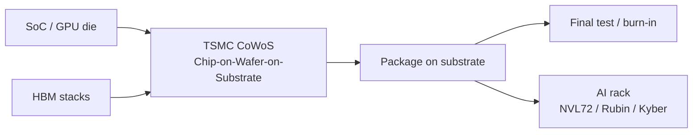

NVIDIA's high-density AI GPU is a **CoWoS package** before it is a rack. This hub does two things: it reads what TSMC has actually published about that process, then maps the Taiwan-listed companies that run it, sit next to it, test it or sell tools into it. Power, water, wide-bandgap switches and the ODMs that assemble the cabinet are separate topics — [800 VDC](/en/topics/nvidia-800v), [liquid cooling](/en/topics/liquid-cooling), [SiC / GaN](/en/topics/sic-gan) and [rack ODM](/en/topics/rack-odm). Every company below has an English memo page with briefings of its earnings calls.

## Part 1 — What TSMC actually specified

Source: TSMC's CoWoS product page at [3dfabric.tsmc.com](https://3dfabric.tsmc.com/english/dedicatedFoundry/technology/cowos.htm). Customer GPU names on that page are historical (Tesla GP100 / GV100). The July 2026 earnings call is the capacity and glass-substrate update, not a rewrite of the process family.

### The product fact

**CoWoS** is Chip-on-Wafer-on-Substrate: TSMC's 2.5D platform, in volume since **2012**. It puts SoCs and high-bandwidth memory on an interposer, then on a substrate. Generative AI from late 2022 is why demand jumped; the process is older than that boom.

Three families, as TSMC names them:

| Family | Interposer | What TSMC says |
|---|---|---|
| **CoWoS-S** | Silicon, with embedded deep-trench capacitors | Up to **3.3× reticle (~2,700 mm²)**. In production since 2012. |
| **CoWoS-R** | RDL (polymer + copper), volume since **2023** | Recommended above 3.3×. Minimum 4 μm pitch. Better C4 integrity as packages grow. |
| **CoWoS-L** | RDL interposer plus embedded **LSI** bridges and eDTC | First **3.5× CoWoS-L in volume since 2024**. Built to go larger still. |

CoWoS-L or CoWoS-R is what TSMC recommends once the interposer is larger than 3.3×. The page does **not** assign Hopper to S and Blackwell to L. Independent teardown houses have described Blackwell B200 / GB100 as CoWoS-L; that is a secondary read, not TSMC's CoWoS page naming those SKUs.

The 2026 Technology Symposium roadmap, as restated on the July earnings call, goes to **14× reticle** CoWoS for still-larger AI packages. That is a size roadmap, not a 2026 revenue split.

### Who runs CoWoS — and who does not

**CoWoS is a TSMC in-house brand.** Other listed names on this page are OSAT alternatives and overflow (FOCoS / VIPack / LEAP), test, or wet-process equipment. They are not a second foundry running TSMC's CoWoS line under TSMC's name.

NVIDIA's published **800 VDC** ecosystem list names Taiwan power-component houses. **It does not name TSMC, ASE, KYEC or Grand Process**, and it does not mention CoWoS. The package sits under the GPU that 800 V *feeds*. A CoWoS call that never said 800 V is still a CoWoS call.

### The conversion the package has to absorb

Specifics worth holding onto:

- **Frontend wafer and backend package are different businesses.** C.C. Wei's July 2026 line: if they were the same, ASE would already be a frontend competitor. TSMC's CoWoS tightness can limit *customer* GPU growth; extra OSAT capacity can still help TSMC's *frontend* wafers get packaged.
- **Glass is an alternative, not this year's mix.** On the same call, the majority "is still CoWoS"; a glass-substrate / glass-core pilot is "about another one year" from being mature enough to put into production with a customer.
- **ABF substrates and HBM stacks are later themes.** Unimicron, Kinsus and Nan Ya PCB stay off this hub. Powertech's HBM pack stays off until the HBM collection. Do not read a substrate or HBM print as a CoWoS-primary note.

## Part 2 — The Taiwan companies

Read the slot before the thesis. Running CoWoS is a different fact from assembling a complementary 2.5D package, testing the finished GPU, or selling a wet bench into someone else's line.

### Process owner

**[TSMC (2330)](/en/tsmc)** — the only name that owns the CoWoS brand. Q2 2026 revenue **NT$1,270.38bn / US$40.2bn**. Advanced packaging, testing, mask-making and others stay in one CapEx bucket at **10–20%** of the raised **US$60–64bn** 2026 budget; C.C. Wei would not split packaging out because testers, packaging tools and frontend tools move as bottlenecks. Packaging capacity is "so tight that now it limits my customers' growth"; he welcomed Intel EMIB-T as overflow that still helps TSMC frontend wafers. Arizona gets another **US$100bn** (total **US$265bn**), including advanced-packaging fabs; Taiwan is building **13** leading-edge and advanced-packaging fabs. The call never said 800 V. One note, Q2 2026.

### OSAT — complementary, not TSMC CoWoS

**[ASE Technology Holding (3711)](/en/ase)** — the largest pure-play OSAT. LEAP advanced-packaging revenue is guided **above the prior US$3.5bn** for 2026 and to **double in 2027**. Jason Chang's line on this call is the honest one: the most advanced wafer-level steps stay with the foundry; ASE takes packaging, test and full-process around that, and will assemble EMIB or another substrate if the customer chooses it. "Not a zero-sum game." Glass: **no production in the next 12 months**. Panel-level 310×310 mm automated line: **2027 Q1**. CPO: small volume from **end-2026**. Q2 ATM gross margin **27.3%**, guided **28–29%** in Q3, with a chance to break the **30%** structural cap in Q4. Capex raised to **US$10.5bn**. The call never said 800 V. One note, Q2 2026.

### Test

**[KYEC (2449)](/en/kyec)** — pure-play wafer probe, final test and burn-in. It does not run CoWoS. It tests the AI GPU and ASIC that come off that package: one burn-in plus two final-test loops, self-made high-power burn-in ovens, and test time that management said is **more than 70%** longer on the next GPU generation. Q4 2025 revenue **NT$9.97bn**, gross margin **37.7%**; FY 2025 **NT$349.33bn**, EPS **NT$9.01**. 2026 capex on that call was **NT$393.72bn** for Rubin and CSP ASIC; a later April board raised it to **NT$500bn**, which is not in this note. The March call never said 800 V. One note, Q4 / FY 2025.

### Equipment

**[Grand Process Technology (3131)](/en/grand-process)** — wet-process etch, strip and clean tools. The May 2026 TPEx briefing listed **2.5D CoWoS** among the advanced-package applications, next to 3D SoIC, HBM, CPO and panel-level. Utilisation **100–120%**; capacity guided **+50% a year** in 2027 and 2028. 2.5D is still the main shipment; 2026 is called the first volume year for 3D hybrid bonding, with mix (and margin) lifting in 2027–28. Q1 revenue **NT$1.596bn**, gross margin **33.8%** on mix and new-fab depreciation. The briefing never said 800 V. One note, Q1 2026.

### Adjacent — not dual-tagged here

These names touch the same AI package. They are not CoWoS-primary in this collection.

- **ABF / substrate** — Unimicron (3037), Kinsus (3189), Nan Ya PCB (8046). Next theme.
- **HBM pack** — Powertech (6239). Later HBM theme.
- **[Hon Hai / Foxconn (2317)](/en/foxconn)** — has discussed CoWoS *capacity* as a GPU-supply constraint on rack shipments. That is an ODM reading TSMC, not a packaging P&L. Full notes: [rack ODM hub](/en/topics/rack-odm).
- **Taisil (3532)** — 12-inch silicon / HBM / CoWoS wafer talk on older dumps; not written here until a call is CoWoS-primary rather than a silicon-wafer mix.

**Blocked for now.** MPI (6223) and Marketech (6196) have 2026 events without a usable Q&A dump in this archive. ASE's US engineering sites are not a second OSAT note.

## How to read these memos

Each memo is an English briefing of one Taiwan earnings call. Figures are as stated by management and are not independently audited. The Chinese transcript and the Chinese memo behind each one stay off this site; the English article is the published work.

Where a company's most recent *earnings* call in our archive is old, the memo says so rather than implying the position is current. "Advanced packaging" percentages are company-stated and are not comparable across issuers — TSMC's 10–20% CapEx bucket, ASE's LEAP dollar target and KYEC's AI-test mix are three different P&L cuts. CoWoS on an OSAT call is complementary capacity or a customer request, not a claim that the OSAT runs TSMC's line.
