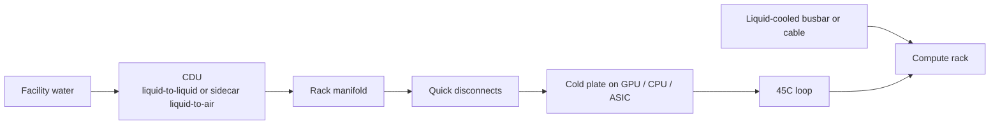

NVIDIA's high-density AI rack is a **liquid-cooled** rack. This hub does two things: it reads what NVIDIA has actually published about that loop, then maps the Taiwan-listed companies that have to build against it. Power and the wide-bandgap switches inside that power chain are separate topics — see the [NVIDIA 800 VDC hub](/en/topics/nvidia-800v) and the [SiC / GaN hub](/en/topics/sic-gan). Every company below has an English memo page with briefings of its earnings calls.

## Part 1 — What NVIDIA actually specified

NVIDIA published a detailed **power** whitepaper. It did **not** publish a matching cold-plate data sheet. Hold the official facts and leave the rest.

### The product fact

**GB200 NVL72** is a liquid-cooled rack: **72 Blackwell GPUs and 36 Grace CPUs**, plus NVLink switch trays, treated as one copper domain. The successor cabinets — GB300, Vera Rubin, then **Kyber** at 1 MW+ — stay on the same path. Air cooling a tray at that density is not the reference design.

At GTC, NVIDIA described the NVL72 loop as **45°C coolant in and 65°C coolant out**. That 45°C number is the one that shows up again on the 800 VDC diagram.

### The cooling block on the 800 VDC diagram

Source: NVIDIA's whitepaper *800 VDC Architecture for Next-Generation AI Infrastructure* (Jared Huntington and Mike Tu), the 800 VDC product page, and the OCP work NVIDIA published with Google and Microsoft.

The power architecture still has to keep the GPU at a temperature a cold plate can hold. NVIDIA draws that as:

Specifics worth holding onto:

- **CDU.** The 17.5 MW reference block feeds four 1.1 MW compute racks **plus CDUs**. The coolant distribution unit is architecture, not an accessory.
- **Sidecar.** A liquid-to-air CDU can sit beside the IT rack when the building has no facility water. The same word is also used for a **power** sidecar. They are different boxes.
- **45°C loop.** Warm enough that many halls can reject heat without a chiller. That is why NVIDIA can talk about liquid cooling and 800 VDC in the same cabinet: both are density moves.
- **Liquid-cooled busbar or cable.** At 1500 A the conductor itself needs cooling. That is a busbar / cable problem, not a GPU cold-plate problem.

### What this hub will not treat as NVIDIA official

Third-party cooling blogs quote thermal resistance, litres per minute and plate flatness as if they were NVIDIA specs. They are not in the whitepaper or on the GB200 NVL72 product page. Those numbers stay off this page.

**OCP Advanced Cooling Solutions (ACS)** is the secondary source: dripless QDs, manifolds, CDUs, facility water. It is an industry plumbing standard, not NVIDIA's vendor list. Taiwan companies that pass NVIDIA or CSP qualification still have to fit that plumbing.

### The timeline that matters for cooling

| Cabinet | Cooling fact that is public | When it shows up in Taiwan calls |
|---|---|---|
| GB200 NVL72 | Fully liquid-cooled rack, 45°C in / 65°C out | 2025 shipments; AVC and Auras already talking mix |
| GB300 / Vera Rubin | Still liquid; some trays **fanless**, which moves value into the internal manifold | 2025Q4–2026 volume on the calls in this collection |
| Kyber / Rubin Ultra | 1 MW+ rack, 800 VDC, same 45°C loop plus liquid-cooled bus | 2027 in the power whitepaper; not yet a dated cooling SKU on these calls |

## Part 2 — The Taiwan companies

Read the slot before the thesis. Selling a cold plate is a different fact from selling a quick disconnect, and both are different from a parent group that keeps the CDU in Thailand.

### Loop hardware — cold plate, manifold, CDU

These names sell the water path on the tray and in the rack. None of them is on NVIDIA's published **800 VDC power** list. The 800V read is that the same cabinet is going fully liquid.

**[Auras Technology (3017)](/en/auras)** — cold plates, manifolds, QDs, chassis and racks as one kit. Claims a seat on all six NVIDIA tray designs. 2026 is its "ASIC first year"; data-center water cooling is guided past **50%** in 2027. Liquid-cooling module capacity is being lifted from **200,000 to 1 million sets a month**, mostly in Vietnam. Two notes, Q1 and Q2 2026. Neither call said 800 V.

**[Asia Vital Components (3324)](/en/avc)** — cold plates, internal and rack manifolds, QDs and CDUs. Stayed out of chassis and fans on purpose. On NVIDIA and AMD recommended-vendor lists. Q3 2025 water mix **35%**, guided **above 55%** in 2026. On Vera Rubin it argues that a **fanless** tray makes the internal manifold larger, so thermal content on the compute tray does not fall even if the cold plate is under cost pressure. Two notes, Q1 and Q3 2025.

**[Jentech Precision (3653)](/en/jentech)** — package lids / vapor chambers and GPU liquid-cooling modules, assembled in-house. GPU water-cooling started shipping in **2025**. A ten-year **microchannel** programme that removes TIM2 is the next-gen claim; that revenue is **not** in the 2025 outlook. The November 2025 call never said 800 V. One note, Q3 2025.

### Quick disconnects

The QD is the dripless fitting between cold plate, manifold and CDU. NVIDIA can specify the supplier. Welding the loop shut is not how a serviceable AI tray is designed.

**[Fositek (6805)](/en/fositek)** — precision mechanics: foldable-phone hinges plus **server slides and liquid-cooling QDs**. Server mix jumped from **5.3% to 36.3%** of 2025 sales. Management claims it is a **main QD supplier on NVIDIA GB200 / GB300 Switch**; Blackwell / Rubin **cold-plate QDs are NVIDIA-decided**. AWS and Google TPU QDs were still in qualification on the March 2026 call. 2026 capacity target: slides **350,000 sets a month**, QDs **3 million pcs a month**. UQD (chassis-to-rack, including floating joints) and MQD (smaller, inside the chassis) are different slots. Two-phase QDs need a higher pressure rating. One note, Q4 / FY 2025. Later 2026 calls in our archive failed transcription.

**AVC** is designing in-house QDs into GB300 and ASIC with a **~30%** attach target — not a 100% replacement of customer-specified parts. That claim lives in the AVC notes, not as a separate QD company.

### The Nidec-group split

**[Nidec Chaun-Choung (6230)](/en/chaun)** — listed in Taiwan, **86.3%** owned by Nidec. NCCI itself is still an **air-cooling** house: heat pipes, vapor chambers, 3D VC, from notebooks to servers. Liquid-cooling **modules** (cold plates) are built at **Kunshan**; **CDUs and QDs** come from parent **Nidec Thailand**. Water is guided at **2–5% of 2025** sales and **about 10% in 2026**. Manifolds were still sampling in August 2025, with small volume hoped for 2026. The August 2025 call never said 800 V. One note, H1 2025.

Treat Chaun as a listed window on Nidec's cooling split, not as a Taiwan CDU vendor. The CDU dollar sits in Thailand.

### Air movement still on the same cabinet

**[Sunonwealth (2421)](/en/sunon)** — fans, including a claimed unique **800 V EC fan** for data-center infrastructure, with first shipments guided for August 2026. Management's stated long-term pair is **water cooling plus data-center EC fans**. Even a liquid-cooled, sometimes fanless, compute tray still needs heat to leave the hall. One note, Q1 2026.

### Adjacent — on the 800V hub, not dual-tagged here

These names discuss cooling on earnings calls but are not cooling-primary in this collection. Their notes stay on the [800V hub](/en/topics/nvidia-800v).

- **[Delta (2308)](/en/delta)** and **[Lite-On (2301)](/en/liteon)** — CDUs and liquid cooling as part of a power-and-thermal stack, next to 800V racks.
- **[Hon Hai / Foxconn (2317)](/en/foxconn)** — self-made CDUs, cold plates, manifolds and QDs inside rack-scale assembly. Self-made content is above 50%, chips excepted. Full ODM notes: [rack ODM hub](/en/topics/rack-odm).
- **[Chenming (3013)](/en/chenming)** — chassis and racks, including liquid-cooling lines.
- **[CviLux (8103)](/en/cvilux)** — connectors into sidecar CBU / BBU.
- **[JPC (6197)](/en/jpc)** — busbars on the OCP ±400 V rail.
- **[GW Instek (2423)](/en/gw-instek)** — instruments for air- and liquid-cooling validation.

**Blocked for now.** TaiSol (3338) and Ennoconn (6414) do not have a usable recent completed dump in this archive.

## How to read these memos

Each memo is an English briefing of one Taiwan earnings call. Figures are as stated by management and are not independently audited. The Chinese transcript and the Chinese memo behind each one stay off this site; the English article is the published work.

Where a company's most recent call in our archive is old, the memo says so rather than implying the position is current. Water-mix percentages are company-stated and are not comparable across issuers without reading the definition — AVC's "water" and Auras's "liquid-cooling modules" are not the same P&L line.
