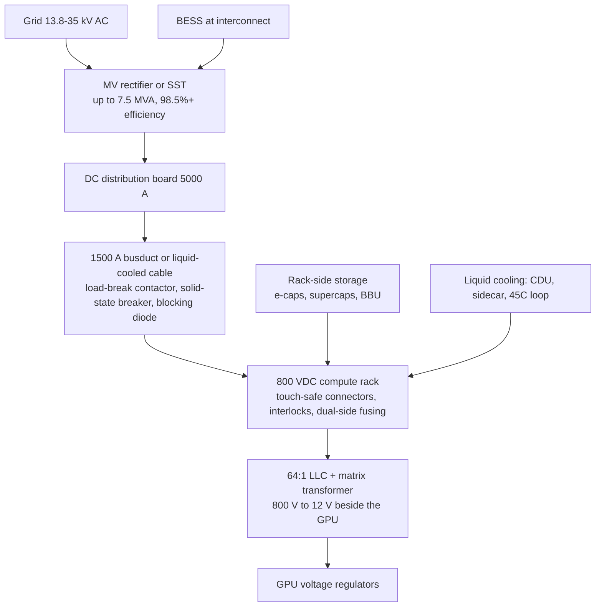

NVIDIA is rebuilding data-center power around **800 VDC**. This hub does two things: it reads NVIDIA's own specification, then maps the Taiwan-listed companies that have to build against it. Every company below has an English memo page with briefings of its earnings calls.

## Part 1 — What NVIDIA actually specified

Source: NVIDIA's whitepaper *800 VDC Architecture for Next-Generation AI Infrastructure* (Jared Huntington and Mike Tu), the 800 VDC product page, and the OCP work NVIDIA published with Google and Microsoft.

### The problem being solved

GPU racks are approaching **100x the power density of web servers**. NVLink makes this worse in a useful way: the more GPUs you keep on one copper domain, the better the performance, so power per rack no longer grows 20% per generation — it can go 2x, 4x, or 8x. Hopper to GB300 was a 75% TDP increase but a **50x performance increase** and a 3.4x jump in rack density.

Two consequences drive the whole architecture:

1. **Power has to leave the NVLink radius.** Space next to the GPU is the most valuable real estate in the rack, so conversion hardware gets pushed outward.
2. **Copper becomes the bottleneck.** At 415 VAC a fixed conductor carries 0.6 kW/mm². At 800 VDC it carries 1.7 kW/mm² — **157% more power through the same copper**, and it removes roughly 200 kg of busbar per rack. Going to 480 VAC only buys 16%.

### The reference stack

Specifics worth holding onto:

- **Single-ended 800 V, not ±400 V.** NVIDIA chose this because two-pole breakers already exist, while ±400 V needs three-pole gear that would have to be developed. The rack still accepts ±400 V sources through symmetric fusing and reinforced isolation, so OCP equipment is not stranded.
- **One conversion beside the GPU.** A 64:1 LLC converter with a matrix transformer takes 800 V straight to 12 V, replacing the 400 V → 50 V → 12 V chain. Worth about 1% efficiency and **26% less board area** in the critical zone.
- **Energy storage is architecture, not an accessory.** GPU load swings between roughly 30% and 100% within milliseconds. NVIDIA sizes storage by timescale: electrolytic capacitors below 100 ms, mixed solutions from 100 ms to 10 s, batteries beyond, plus facility BESS at the grid interconnect. A 50%-duty square wave with 50% overshoot raises RMS losses 25%, so smoothing has to happen close to the GPU.
- **Safety is spelled out.** Touch-safe connectors everywhere a human can reach, mechanical interlocks so nothing disconnects under load, and fuses on both the high and low side of the DC/DC. The connector approach is borrowed from EV chargers.
- **Reference design.** A 17.5 MW block: five 3.5 MW MV rectifiers in "5-to-make-4" redundancy, a 5000 A DC distribution board, 1500 A busducts, feeding four 1.1 MW compute racks plus CDUs. One surviving rectifier still carries 3.3 MW.

### The timeline

| Phase | What it is | When |
|---|---|---|
| Side power rack / sidecar | Retrofit: rectifiers moved into a dedicated rack beside compute, no building changes | MGX-compatible rack in 2H 2026 |
| Row power center | Shared per row, overhead 800 VDC busway, up to 2 MW per row | 2027 |
| DC power block | New builds: grid to 800 VDC in one step | With Kyber at scale |

Full production lines up with **Kyber** in **2027** — the rack that holds **576 Rubin Ultra GPUs** at 1 MW+.

### Who NVIDIA named

NVIDIA's published ecosystem list has three tiers. Four Taiwan-linked names appear on it:

| Tier | Taiwan names |
|---|---|
| Power system components | **Delta (2308)**, **LITEON (2301)**, **BizLink (3665)** |
| Silicon | **Richtek** — a MediaTek subsidiary, no separate listing, so no earnings page here |

The rest of the list is non-Taiwan: ADI, Infineon, onsemi, TI, Navitas, Innoscience, MPS, Power Integrations, Renesas, ROHM, ST, AOS, EPC on silicon; Flex, Lead Wealth, Megmeet on components; ABB, Eaton, GE Vernova, Heron Power, Hitachi Energy, Mitsubishi Electric, Schneider, Siemens, Vertiv on data-center power systems.

## Part 2 — The Taiwan companies

Read the tier label before the thesis. Being on NVIDIA's list is a different fact from a company telling its own shareholders it is working on HVDC.

### Named by NVIDIA

**[Delta Electronics (2308)](/en/delta)** — the deepest stack of any Taiwan name: power shelves, rack power, BBUs, DC-DC bricks, liquid cooling, and medium-voltage DC work including solid-state transformers. As early as December 2024 management said 380/400 V was the industrial standard and 800 V would be a customized data-center standard requiring time — while stating Delta had no technical problem building it.

**[Lite-On (2301)](/en/liteon)** — the clearest dated 800V calendar in the cohort. Sampling of an 800V HVDC Power Rack was guided to November 2026 with volume in 2027Q1, after an earlier 400 V rack generation. Five memos track how that date moved.

**[BizLink (3665)](/en/bizlink)** — connectors and cable assemblies, the slot NVIDIA fills with touch-safe interlocked connectors and liquid-cooled cables. Coverage here is historical; see the memo for the data caveat.

### Named by brokers as a Kyber build partner

**[Hon Hai / Foxconn (2317)](/en/foxconn)** — rack-scale assembly, and already vertically integrating the pieces 800V touches: busbars, CDUs, cold plates, manifolds, quick disconnects, plus in-house SiC modules.

### Second-tier reads with their own HVDC disclosure

These are not on NVIDIA's list. They are Taiwan-listed suppliers that discussed 800V or HVDC on their own earnings calls, sorted by where they sit in the stack.

**Rack power, BBU, and protection**

- **[Chang Wah Technology (6548)](/en/chang-wah)** — leadframes. The only name here with 800V already in the revenue mix: 6–8% of sales at a 30–50% ASP premium.
- **[Jih Lin Technology (5285)](/en/jih-lin)** — power leadframes too: top-side cooling and Clipper parts transferred from auto modules into AI-server HVDC. No sales share disclosed.
- **[Systems Electronics (5309)](/en/systems)** — BBUs. 11 kW and 5.5 kW mass-produce in 2026Q2; a 25 kW HVDC BBU is in development with two customers, volume 2027–28. Met NVIDIA; not a supplier.
- **[Sitel (7740)](/en/sitel)** — 1500 V storage platform stepped down to an 800 V HVDC BBU for AIDC, beside facility BESS.
- **[AcBel (6282)](/en/acbel)** — CRPS and data-center PSUs at about 20% of 2025 sales. The latest call never said 800V or HVDC.
- **[Kinpo (2312)](/en/kinpo)** — one sentence: EV-charger power management extended into HVDC and high-end server racks. Not a business yet.
- **[Voltronic Power (6409)](/en/voltronic)** — UPS DMS house with an HVDC PSU prototype, leaning on 400/800/1000 V EV-charger experience.
- **[Polytronics (6642)](/en/polytronics)** — circuit protection at the AC/HVDC boundary; 277 V and 305 V AC PPTC into Amazon and Super Micro.
- **[Song Chuan Precision (7788)](/en/song-chuan)** — HVDC DC relays and Super Seal liquid-cooled types, qualifying with Delta, Lite-On and AcBel. EV 400→800 V is a separate line.

**Silicon, magnetics, and test**

- **[Anstek (3528)](/en/anstek)** — distributes ADI's 800 V hot-swap controllers, already shipping to US CSP ODMs.
- **[Episil-Precision (3016)](/en/episil-precision)** — GaN epitaxy is in 800 V HVDC systems at small-volume trial.
- **[Episil Technologies (3707)](/en/episil)** — SiC/GaN foundry. 800 V is a 2027 600 kW-rack demand thesis; GaN already growing on AI servers, SiC still down.
- **[Actron Technology (8255)](/en/actron)** — SiC modules 650–3300 V; custom HVDC modules exclusive to a domestic customer, sampling now. Dated roadmap: HVDC 2027–30, SST 2031–35.
- **[GEM Services (6525)](/en/gem)** — power OSAT. HVDC rack architecture is a customer-drawing question; the 2025 AI beat is thermal packaging.
- **[Acme Electronics (8121)](/en/acme)** — ferrite cores already shipping into HVDC 800 V PSUs; N-type SiC powder sampling for the same architecture.
- **[UMEC (2413)](/en/umec)** — switch-side PSU. 800 V HBDC for 8 kW+ networking power, with Accton; explicitly not entering compute Power Rack.
- **[GW Instek (2423)](/en/gw-instek)** — HVDC, SST and high-power PSU-module instruments in customer evaluation. What ships today is AI-server and liquid-cooling validation gear.

**Mechanicals, interconnect, cooling**

- **[Sunonwealth (2421)](/en/sunon)** — claims a unique 800 V EC fan for data-center infrastructure.
- **[Chenming (3013)](/en/chenming)** — chassis and racks; studying both the OCP ±400 V and NVIDIA 0–800 V camps.
- **[CviLux (8103)](/en/cvilux)** — connectors into 18.5 kW power shelves, sidecar BBU/CBU and 48 V DC-DC. Architecture read; the call never said 800 V.
- **[JPC (6197)](/en/jpc)** — busbars, but on the OCP ±400 V rail rather than NVIDIA's single-ended 800 V.

### Medium-voltage / facility power

NVIDIA's diagram starts at 13.8–35 kV AC. These names electrify the building. They are not rack 800 VDC suppliers. **800 kW** on a Taiwan call is usually the large-user tariff threshold, not 800 V.

- **[TECO (1504)](/en/teco)** — US data-center motors, transformers, switchgear; first busway order late July 2026; Thailand AIDC via Danasai.
- **[Allis Electric (1514)](/en/allis)** — MV switchgear, transformers, substations and UPS into fabs and IDC rooms. About NT$1bn of IDC orders; not NVIDIA's MV rectifier / 5000 A DC board.
- **[Chung-Hsin Electric (1513)](/en/chung-hsin)** — GIS, generators and HVAC. Semiconductor GIS qualification and AI/IDC hall demand; still AC-side facility gear.

## How to read these memos

Each memo is an English briefing of one Taiwan earnings call. Figures are as stated by management and are not independently audited. The Chinese transcript and the Chinese memo behind each one stay off this site; the English article is the published work.

Where a company's most recent call in our archive is old, the memo says so rather than implying the position is current.
