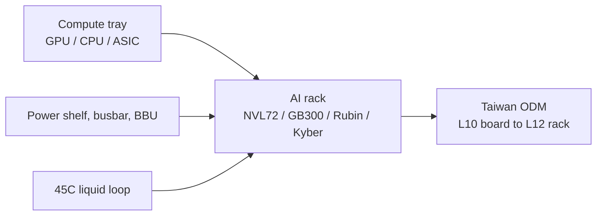

NVIDIA's high-density AI product is a **rack**, not a server in a random chassis. This hub does two things: it reads what NVIDIA has actually published about that cabinet, then maps the Taiwan-listed ODMs that bolt it together. Power, water, wide-bandgap switches and the CoWoS package under the GPU are separate topics — [800 VDC](/en/topics/nvidia-800v), [liquid cooling](/en/topics/liquid-cooling), [SiC / GaN](/en/topics/sic-gan) and [CoWoS](/en/topics/cowos). Every company below has an English memo page with briefings of its earnings calls.

## Part 1 — What NVIDIA actually specified

Source: NVIDIA's GB200 NVL72 product page, the MGX rack programme, and the 800 VDC whitepaper *800 VDC Architecture for Next-Generation AI Infrastructure* (Jared Huntington and Mike Tu).

### The product fact

**GB200 NVL72** is one copper domain: **72 Blackwell GPUs and 36 Grace CPUs**, plus NVLink switch trays, in a liquid-cooled rack. Successors — GB300, Vera Rubin, then **Kyber** at **576 Rubin Ultra GPUs** and 1 MW+ — stay on that path. Air-cooling a tray at that density is not the reference design.

**MGX** is the modular rack NVIDIA sells as a partner programme. The 800 VDC architecture's first phase is an MGX-compatible **side power rack** in 2H 2026. Full 800 VDC production lines up with Kyber in **2027**.

### Who NVIDIA named — and who it did not

The published 800 VDC ecosystem list names Taiwan **power-component** houses (Delta, Lite-On, BizLink, Lead Wealth) and **Richtek** on silicon. **It does not name a Taiwan ODM.** Rack assembly is a different fact from a named power SKU.

Foreign brokers have named **Hon Hai / Foxconn** among the Taiwan partners building Kyber. Quanta and Wiwynn sit in the same slot by what they tell their own shareholders, not by an NVIDIA vendor PDF.

### The conversion the ODM has to absorb

Specifics worth holding onto:

- **The ODM is the integrator.** NVIDIA specifies the domain. The listed company that ships the cabinet is the one answering for yield, liquid loop, busbar, test power and a factory that can take 1 MW-class racks.
- **Consignment versus buy-and-sell** is how that BOM hits the P&L. High-ASP GPUs inflate revenue and crush gross-margin *percent* unless the customer ships the chip. Every name on this page is negotiating that mix.
- **800 V is the 2027 cabinet.** 2026 calls date **Vera Rubin / GB** shipments. Do not read a 2026 ship date as an 800 VDC design win.

## Part 2 — The Taiwan companies

Read the slot before the thesis. Assembling NVL72 for a hyperscaler is a different fact from building a sovereign-AI Level-12 rack, and both are different from making the sheet-metal chassis.

### Rack-scale ODMs

These names sell the finished cabinet. Dual-tagged here and on the 800V hub, because the same rack is what 800 VDC is written against.

**[Hon Hai / Foxconn (2317)](/en/foxconn)** — brokers' Kyber build partner. Cloud and networking crossed **51%** of Q2 2026 sales. Self-made content is above **50%**, chips excepted: busbars, CDUs, cold plates, manifolds, QDs, plus in-house SiC. **Vera Rubin** is guided to production readiness in Q3 2026 and shipments in Q4, with a **50%** share target; that is the 2026 cabinet, not Kyber. ASIC share is aimed at **40% or more**. Capacity: **2,000 racks a week** in 2026. None of the 2026 calls named 800 V. Six notes, through Q2 2026.

**[Quanta Computer (2382)](/en/quanta)** — notebook ODM that is now a server company by mix. Servers were **above 80%** of sales from Q1 2026; **AI was 75–80%** of server revenue in the first half, guided to **80%** in the second. Q2 2026 revenue **NT$1.04tn**. AI-server revenue is guided to **double** in 2026; order visibility is talked about through **2028**. Capacity is guided to **double by end-2026** versus end-2025, and to double again in Taiwan when the acquired AUO Huaya plant starts in **2028**. The Huaya building already has **high-voltage supply for outgoing test** — factory test power, not NVIDIA's 800 VDC rail. The 13 August 2026 call never said 800 V. One note, Q2 2026.

**[Wiwynn (6669)](/en/wiwynn)** — Wistron-group CSP specialist. 2025 AI mix crossed **50%**, of which **ASIC was about 90%** and GPU the rest. GB200 GPU projects printed in Q4 2025 and then rolled off; new NVIDIA and AMD GPU platforms plus new ASIC platforms are guided to **2H 2026**. Level-12 (full-rack) work is described as **tenders and sovereign AI**, taken selectively. Air- and water-cooling capacity are both in; factory **power is planned to 2028**. The 26 February 2026 call never said 800 V. A later AGM (25 May 2026) did mention HVDC, CPO and cooling as ecosystem work — that sentence is not in this note. Q2 2026 was a board results release, not a 法說會. One note, FY 2025 / Q4.

### Adjacent — on the 800V hub, not dual-tagged here

**[Chenming (3013)](/en/chenming)** — chassis and racks, including liquid-cooling lines. It studies both the OCP ±400 V and NVIDIA 0–800 V camps. It is sheet metal, not a hyperscaler ODM book.

**Blocked for now.** Inventec (2356) and Wistron (3231) assemble servers, including AI. They are not written here until a completed dump shows the NVIDIA rack as the primary story rather than a notebook-and-server mix. Wiwynn's May 2026 Yuanta and Morgan Stanley conference decks are broker days, not company earnings calls.

## How to read these memos

Each memo is an English briefing of one Taiwan earnings call. Figures are as stated by management and are not independently audited. The Chinese transcript and the Chinese memo behind each one stay off this site; the English article is the published work.

Where a company's most recent *earnings* call in our archive is old, the memo says so rather than implying the position is current. "AI server" mix percentages are company-stated and are not comparable across issuers — Foxconn's cloud-and-networking line, Quanta's AI-within-servers ratio and Wiwynn's AI-versus-general split are three different P&L cuts.
